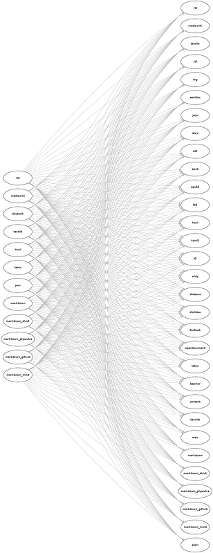
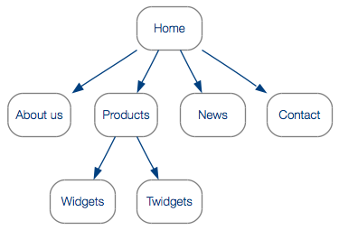
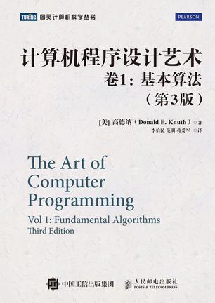
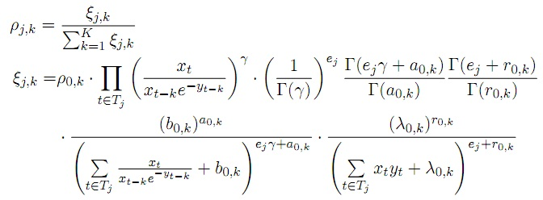

​​

Pandoc
---

> Pandoc是一个标记语言转换工具，可实现不同标记语言间的格式转换，堪称该领域中的“瑞士军刀”。

可以将 markdown、 reStructuredText、 textile、 HTML、 DocBook、 LaTeX、 MediaWiki markup、 TWiki markup、 OPML、 Emacs Org-Mode、 Txt2Tags、 Microsoft Word docx、 LibreOffice ODT、 EPUB、 Haddock markup

转化为

XHTML、 HTML5、 以及HTML幻灯片Slidy， S5，或者DZSlides、Microsoft Word docx、 OpenOffice/LibreOffice ODT、 OpenDocument XML、EPUB、DocBook、 GNU TexInfo、 Groff man pages、LaTeX、 ConTeXt、 LaTeX Beamer slides、PDF via LaTeX、Markdown、 reStructuredText、 AsciiDoc、 MediaWiki markup、 Emacs Org-Mode、 Textile

上图

我最常用的就是：将md转化为workd及pdf。我的毕业论文及之前的几本电子书都是这么做的，它是一个命令行工具，安装方式：

 - Windows: choco install pandoc 
 - Ubuntu/CentOS/OpenSUSE: apt-get intall pandoc 或者 yum install pandoc
 - Mac OS: brew install pandoc

使用方式如下：
 
      pandoc fullstack.md -o fullstack.docx
     
如果要转为PDF，则需要另外的一个工具——LaTeX

Graphviz
---

> Graphviz （英文：Graph Visualization Software的缩写）是一个由AT&T实验室启动的开源工具包，用于绘制DOT语言脚本描述的图形。它也提供了供其它软件使用的库。

简单的来说，就是将代码转换为图形:

它让我最惊讶的是DOT语言，简直是以我们平时的用法来定义的。上面的图形的代码类似于这样的：

    home->products->widgets
    
又是一个让人惊呆的黑科技，这才是人类应该使用的语言。它可以支持PostScript，PDF，SVG，PNG等一系列的格式，用法

     dot -T png phodal.dot -o phodal.png

简单、粗暴到没有朋友。

ImageMagick
---

> ImageMagick (TM) 是一个免费的创建、编辑、合成图片的软件。它可以读取、转换、写入多种格式的图片。图片切割、颜色替换、各种效果的应用，图片的旋转、组合，文本，直线，多边形，椭圆，曲线，附加到图片伸展旋转。

来自重点：可以支持超过两百多种格式。It can read and write images in a variety of formats (over 200) including PNG, JPEG, JPEG-2000, GIF, TIFF, DPX, EXR, WebP, Postscript, PDF, and SVG.

它提供了一个命令行工具叫：``convert``，这可以自由地转换图片的形式，如：

    convert image.jpg image.png

还可以加各种效果，如：

顺便做个介绍：上面的这个人叫瑞典模特儿莱娜·瑟德贝里，是在刊于1972年11月号《花花公子》杂志上的一张裸体插图照片的一部分。**她的脸部与裸露的肩部已经变成了事实上的工业标准。**

又是一个简单、粗暴到没有朋友的工具。

TeX 和 Latex
---

TeX是由是一个由美国计算机教授高德纳（Donald Ervin Knuth）编写的功能强大的排版软件。顺便推荐一下他写的一本书：《计算机程序设计艺术》。因为：

> 高德纳最早开始自行编写TEX的原因是当时十分粗糙的排版水平已经影响到他的巨著《计算机程序设计艺术》的印刷质量。他以典型的黑客思维模式，最终决定自行编写一个排版软件：TEX。他原本以为他只需要半年时间，在1978年下半年就能完成，但最终他用了超过十年时间，直到1989年TEX才最终停止修改。

这直接让我想起Martin Fowler在写《领域特定语言》里好像也是用DSL~~。Tex的最大优点是可以写出下面的这本复杂的公式：

LaTeX 建立在 TeX 之上的工具，它在TeX的基础上大大改善了易用性。对了，如果只是一般的用途的话，就没有必要拿去装逼了~。

它也是工作于命令行上的工具。
